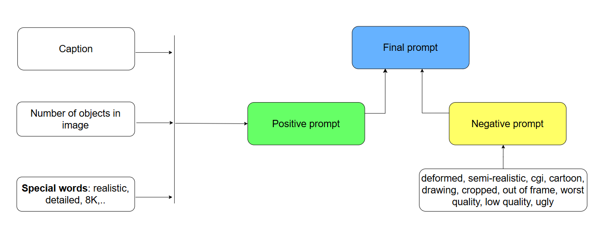
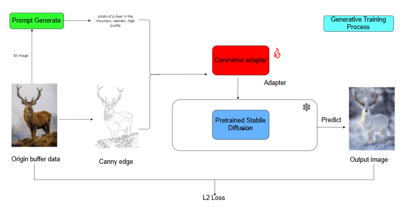
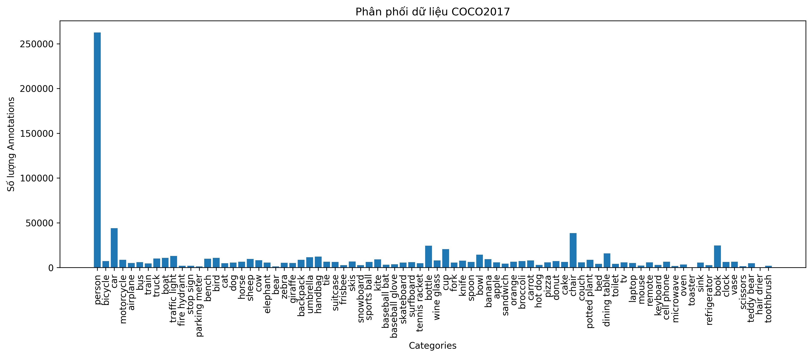
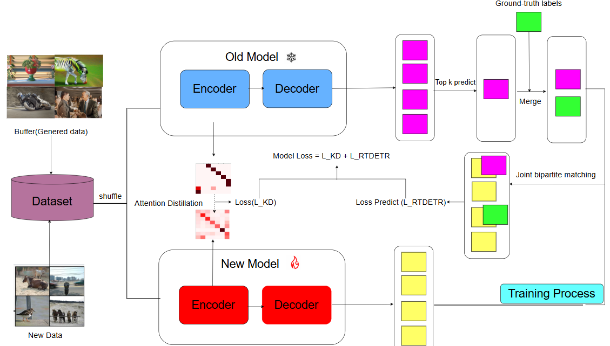

# 🔄 CL-RTDETR-DIFFUSION

**Class-incremental object detection on COCO, where the replay buffer is regenerated by a diffusion model instead of stored.**

**❓ Key question:** how do we generate new replay data while still keeping the ground-truth class and bounding box valid? — **ControlNet**, conditioned on a Canny edge map of the original image, keeps geometry fixed while redrawing everything else, so the original boxes still apply to the generated image.

This README is a short overview. For the full technical report — code walkthrough, all ablations, thesis translation, and known issues — see [`report.md`](report.md).

## 🏆 Results

COCO 2017, two tasks, RT-DETR R50-vd @ 640×640. Baselines from their respective papers, best per column in **bold**.

**40–40 split** — best in the table on 5 of 6 metrics.

| Model | AP | AP₅₀ | AP₇₅ | AP_S | AP_M | AP_L |
|---|---|---|---|---|---|---|
| ERD | 36.9 | 54.5 | 39.6 | 21.3 | 40.3 | 47.3 |
| CL-DETR | 42.0 | 60.1 | **51.2** | 24.0 | 48.4 | 55.6 |
| SDDGR | 43.0 | 62.1 | 47.1 | 24.9 | 46.9 | 57.0 |
| ⭐ **Ours** | **46.4** | **63.3** | 50.3 | **28.9** | **49.8** | **62.8** |

**70–10 split** — overall AP trails VLM-PL slightly, but 🚀 **wins on AP_S and AP_L** — the size extremes where old-class detail is hardest to retain.

| Model | AP | AP₅₀ | AP₇₅ | AP_S | AP_M | AP_L |
|---|---|---|---|---|---|---|
| ERD | 34.9 | 51.9 | 35.7 | 17.4 | 38.8 | 45.4 |
| CL-DETR | 35.8 | 53.5 | 39.5 | 19.4 | 43.0 | 48.6 |
| SDDGR | 38.6 | 56.2 | 42.1 | 22.3 | 43.5 | 51.4 |
| VLM-PL | **39.8** | **58.2** | **43.2** | 22.4 | **43.5** | 51.6 |
| **Ours** | 39.2 | 53.6 | 42.8 | **24.8** | 42.8 | **54.8** |

Pseudo-labels are the dominant factor behind these gains, worth ~24 AP on 40–40. Full baseline set (LWF, RILOD, SID, ABR), ablations, and what these numbers can/cannot support: [`report.md`](report.md).

## 🔬 Method

[RT-DETR](https://github.com/lyuwenyu/RT-DETR) (R50-vd) learns COCO 2017 in disjoint groups of classes, one task at a time. Naively fine-tuning on a new task collapses accuracy on old classes: every old-class object is still in the image but has no label, so the matcher trains the model to treat it as background. We counter this with three mechanisms, active from task 1 onward:

1. 🏷️ **Pseudo-labels** — the frozen previous-task model relabels old classes in new-task images, so the matcher optimizes old and new jointly instead of erasing old classes.
2. 🎯 **Attention distillation** — MSE between old and new model's self-attention in the last encoder layer, a softer constraint with no confidence threshold.
3. 🎨 **Diffusion replay** — instead of storing old images verbatim, a sample of them is regenerated by Stable Diffusion + ControlNet, conditioned on a Canny edge map, so geometry (and bounding boxes) survive but texture/lighting/background are redrawn:

```
old image ──► Canny edges ──────┐
                                 ├──► ControlNet + SD ──► new pixels, same layout, original boxes
COCO caption + object counts ──►┘
```

**Prompt construction for diffusion replay:**



Positive prompt = the image's real COCO caption + its object counts (e.g. `two dogs, one bicycle`) + fixed quality words (`realistic, detailed, 8K, ...`). Negative prompt is a fixed list (`deformed, cgi, cartoon, low quality, ...`). Object counts matter because the edge map fixes *where* objects are but the text encoder still under-generates repeated instances.

**🧩 How the ControlNet adapter is trained:**



Stable Diffusion itself stays frozen; only a ControlNet adapter is trained. For each buffer image, the pipeline takes the Canny edge map + the generated prompt, feeds both into the (trainable) adapter, which conditions the (frozen) pretrained SD U-Net to predict an output image. The predicted image is compared against the original buffer image with an L2 loss, so the adapter learns to keep the diffusion output faithful to the original layout while SD's own weights are never touched.

**📊 Why the buffer is filled per class, not by sampling images uniformly:**



COCO's annotation counts span about three orders of magnitude — `person` alone has ~262k annotations while many tail classes (`hair drier`, `toaster`, `scissors`) have only a few hundred. Sampling buffer images uniformly at random would return a buffer dominated by `person`/`car`/`chair`, so buffer selection instead targets a fixed rate per class to keep rare classes represented.



## 🚀 Install & run

```bash
conda create -n tan python=3.10 && conda activate tan
pip install -r requirements.txt          # torch 2.0.1 / torchvision 0.15.2 / diffusers 0.31.0

python scripts/train.py                                    # task 0, default config
torchrun --nproc_per_node=<N> scripts/train.py              # multi-GPU
python scripts/train.py -c <cfg> -r ckpt.pth --test-only    # evaluate only
```

Before running: replace the hardcoded `/workspace/...` paths in `configs/` with your own, and set `export WANDB_MODE=offline` if you don't have a W&B account (logging is otherwise mandatory).

There is no loop over tasks — one process trains one task, and `task_idx` must be set consistently across `configs/rtdetr/include/dataloader.yml`, `configs/rtdetr/include/rtdetr_r50vd.yml`, and `configs/cl_pipeline.yml`. For task 1, also point `teacher_path` at the task-0 checkpoint and enable `pseudo_label`/`distill_attn`. Details, the diffusion-buffer generation pipeline, and repo layout: see [`report.md`](report.md).
