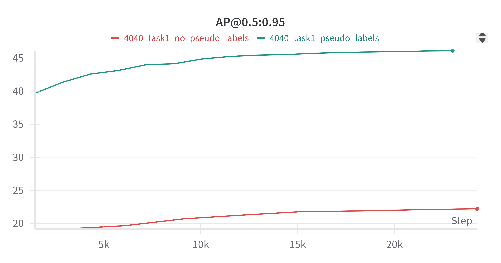
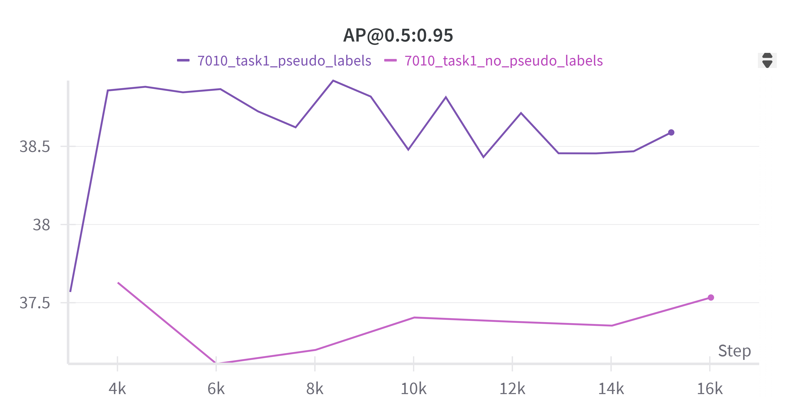
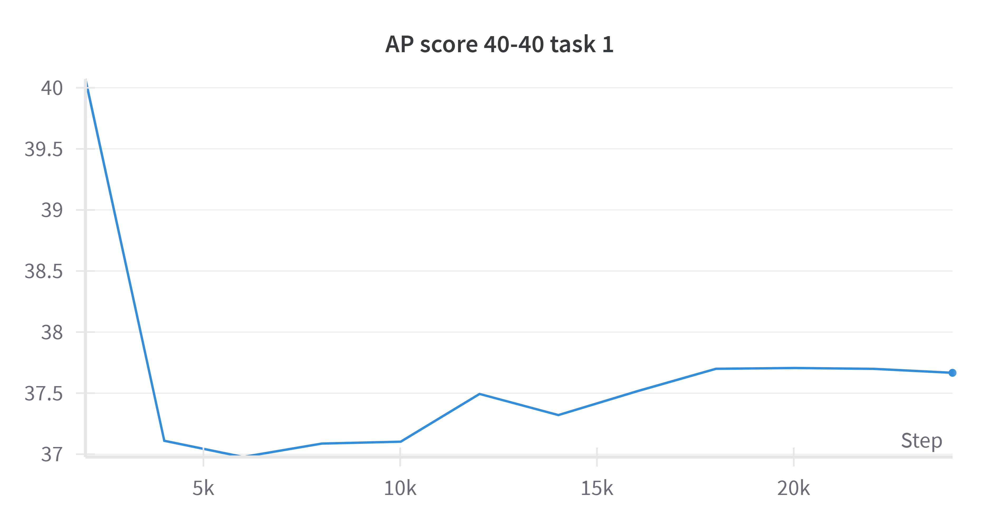
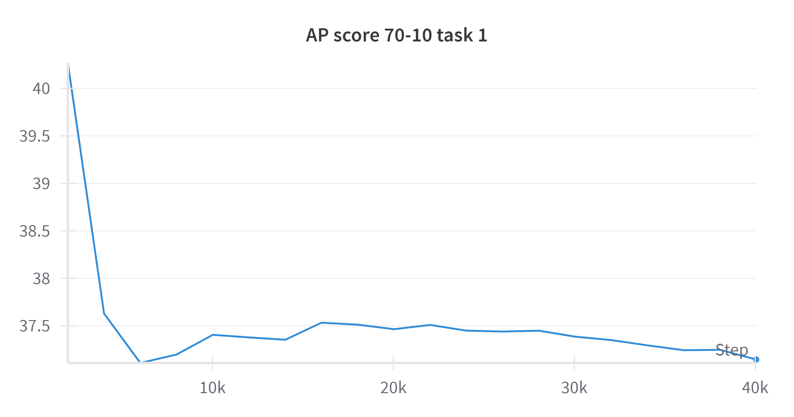
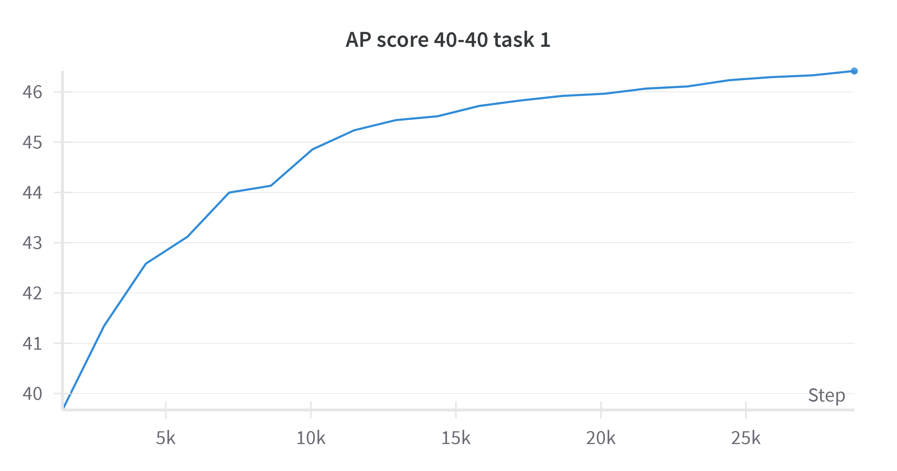
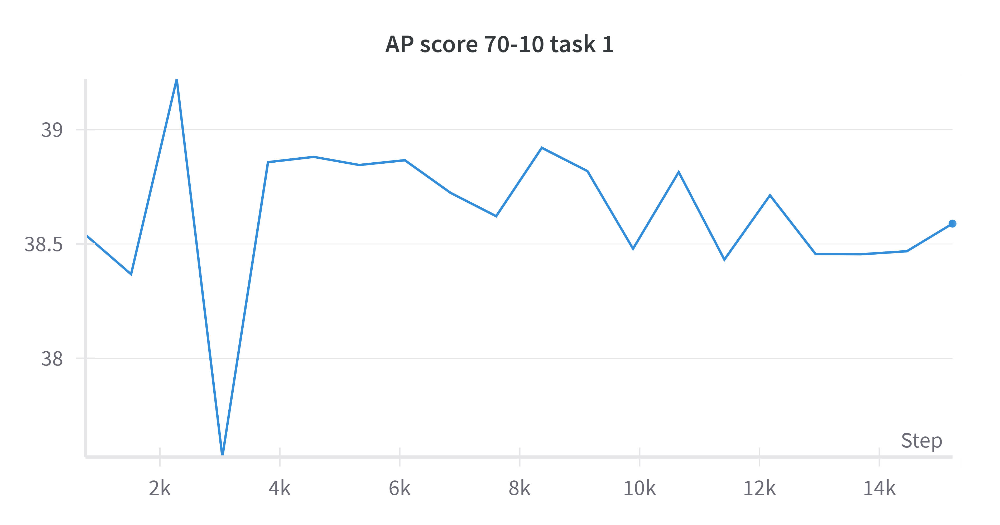
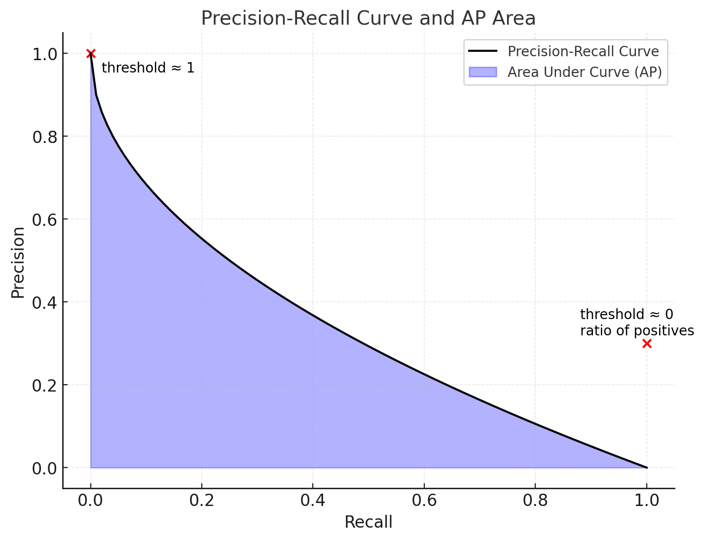

# CL-RTDETR-DIFFUSION — Repository Report

**Date:** 2026-08-14 · **Branch:** `main` @ `30b020c` · **Scope:** full read of `configs/`, `scripts/`,
`src/`, `images/`, plus the thesis sources `experiment.tex` (Ch. 4) / `conclusion.tex` (Ch. 5), whose
English translation is merged into §8 below (previously a separate `results.md`, now folded in here so
this report is the single source of technical detail; `README.md` is the short overview).

---

## 1. What the project does

Class-incremental object detection on COCO 2017. An RT-DETR (ResNet50-vd) detector is trained on a
sequence of disjoint class groups; each task's dataset exposes only that task's categories, so without
intervention the model catastrophically forgets earlier classes. Three mechanisms counter this:

| Mechanism | Where | Enabled by | Evidence strength (§3.4) |
|---|---|---|---|
| Pseudo-labels from frozen teacher | `src/solver/det_engine.py::fake_query` | `pseudo_label` | ✅ ablated on/off |
| Encoder self-attention distillation | `src/solver/det_engine.py::compute_attn` | `distill_attn` | ⚠️ weight sweep only (no β=0) |
| Generative (diffusion) replay buffer | `src/create_buffer/`, `src/data/cococl/coco_cache.py` | `buffer_mode` | ❌ qualitative only |

The distinguishing contribution is the third: replay images are **re-synthesized** by Stable Diffusion
+ ControlNet from a Canny edge map of the original, rather than stored verbatim. Edge conditioning
preserves object geometry, so the original COCO bounding boxes remain valid on the synthetic image.
⚠️ It is also the *least* evidenced of the three — read **§3.4** before attributing any AP gain to a
specific mechanism.

---

## 2. Architecture

### 2.1 Config system

Inherited from upstream RT-DETR: a registry (`src/core/yaml_utils.py`) plus YAML injection.
`@register` stores a class's **argspec schema**, not the class. `load_config` resolves `__include__`
recursively into one flat dict — **later includes win**, so the order in
`configs/rtdetr/rtdetr_r50vd_coco.yml` is load-bearing:

```
runtime.yml → dataset/coco_detection.yml → include/dataloader.yml
→ include/optimizer.yml → include/rtdetr_r50vd.yml → cl_pipeline.yml
```

(`optimizer.yml` flips `use_ema` to True *after* `runtime.yml` set it False.) `YAMLConfig` exposes
`model` / `criterion` / `optimizer` / dataloaders as cached properties that call `create()` lazily, so
nothing is instantiated until first access. Optimizer parameter groups are matched by **regex over
parameter names**, with an assertion that every trainable parameter is visited exactly once.

### 2.2 Execution path

`scripts/train.py` → `YAMLConfig` → `TASKS["detection"]` = `DetSolver` → `BaseSolver.setup/train` →
`DetSolver.fit` → `train_one_epoch` / `evaluate`. Model internals (`src/rtdetr/`) are upstream RT-DETR
apart from the added `task_idx`.

### 2.3 Class splits

`src/data/cococl/cl_utils.py::data_setting(ratio)` maps a ratio *string* to lists of **raw COCO
category ids (1–90, with gaps)**. Because of the gaps the names match true class counts: `"7010"` = 70
old + 10 new, `"4040"` = 40 + 40, plus `"402020"`, `"4010101010"`, `"1010"`, `"20"`. `"80"` returns all
classes twice and is what the val dataloader uses, so evaluation always spans everything seen.

`CocoDetectionCL` keeps only images containing the current task's classes **and drops other classes'
annotations inside those images** — this is what makes the setting genuinely incremental.

### 2.4 CL losses at task > 0

- `fake_query()`: teacher forward → top-30 queries → threshold 0.3 → keep old-class predictions →
  concatenate onto ground-truth boxes/labels before joint bipartite matching.
- `compute_attn()`: forward hook on `model.encoder.encoder[-1].layers[-1].self_attn` for teacher and
  student; MSE between attention maps. Verified empirically: `nn.MultiheadAttention` is called as
  `src, _ = self.self_attn(...)` with `need_weights` left at its default `True`, so the hook's
  `output[-1]` is the **softmax attention map** `[B, L, L]` — not the attended features. With
  `use_encoder_idx: [2]` / `num_encoder_layers: 1`, `L` = the P5 (stride-32) token count, i.e. 400 at
  640×640, giving a `[B, 400, 400]` map. So the KD target is a single attention matrix over the
  smallest feature map — the backbone, the FPN/PAN, and the whole decoder are unconstrained.
- ⚠️ **Cost: 4 forward passes per step, not 1.** With both mechanisms on, `train_one_epoch` runs
  `compute_attn(teacher)` → `compute_attn(student)` → `teacher_model(...)` for pseudo-labels →
  `model(...)` for the real loss (`det_engine.py:242-253, 274`). The teacher is forwarded **twice**
  when one pass could serve both mechanisms, and the student is forwarded twice with grad enabled
  because `compute_attn` does not reuse the training forward. Hooking one small module is cheap; the
  forward pass needed to reach it is not. Distillation here is **narrow in scope but expensive in
  wall-clock** — it should not be described as making training efficient.
- Combined as **`loss = rtdetr_loss * 1 + location_loss * 2`** — the KD weight is hardcoded in
  `det_engine.py`, not exposed in YAML.
- Both auto-disable at `task_idx == 0`. `RTDETR.forward` also only applies `multi_scale` jitter at
  task 0; later tasks train at fixed 640×640.

### 2.5 Diffusion replay pipeline (offline, 3 manual stages)

1. **`create_buffer.py`** — `ABR` selects `buffer_image_rate` of old-class images per class, writes
   `buffer.json`, `buffer_diffusion.json` (images with <4 objects only) and `all_anns.json`.
2. **`diffusion_sd.py` / `diffusion_sdxl.py`** — Canny → ControlNet → SD 1.5 / SDXL. Prompts built
   from category names via `inflect` (pluralized + counted); SDXL variant also uses the real COCO
   caption. `replace_small_objects()` pastes original pixels back over any box under 96².
3. **`kaggle_control.py`** — optional ControlNet-adapter fine-tuning on COCO (frozen VAE/UNet/text
   encoder, MSE on noise residual), matching `images/controlnet_architect.png`.

---

## 3. Experimental results

Numbers below come from `experiment.tex` (full English translation in §8); the curve values are read off the W&B plots in
`images/`. Setup: COCO 2017, RT-DETR R50-vd, 640×640, batch 38, 20 epochs, Ubuntu 20.04 / RTX 3090 24 GB
/ Ryzen 3970X / 128 GB RAM.

### 3.1 Headline comparison against published baselines

**40–40 split** — best AP in the table on every measure except AP₇₅:

| Model | Backbone | AP | AP₅₀ | AP₇₅ | AP_S | AP_M | AP_L |
|---|---|---|---|---|---|---|---|
| LWF | GFLv1 | 17.2 | 45.0 | 18.6 | 7.9 | 18.4 | 24.3 |
| RILOD | GFLv1 | 29.9 | 45.0 | 32.9 | 18.5 | 33.0 | 40.5 |
| SID | GFLv1 | 34.0 | 51.4 | 36.3 | 18.4 | 38.4 | 44.9 |
| ERD | GFLv1 | 36.9 | 54.5 | 39.6 | 21.3 | 40.3 | 47.3 |
| ABR | Faster R-CNN | 34.5 | 57.8 | 35.2 | — | — | — |
| CL-DETR | Deformable DETR | 42.0 | 60.1 | **51.2** | 24.0 | 48.4 | 55.6 |
| SDDGR | Deformable DETR | 43.0 | 62.1 | 47.1 | 24.9 | 46.9 | 57.0 |
| **Ours** | RT-DETR | **46.4** | **63.3** | 50.3 | **28.9** | **49.8** | **62.8** |

**70–10 split** — best on the size-stratified extremes (AP_S, AP_L), competitive elsewhere:

| Model | Backbone | AP | AP₅₀ | AP₇₅ | AP_S | AP_M | AP_L |
|---|---|---|---|---|---|---|---|
| LWF | GFLv1 | 7.1 | 12.4 | 7.0 | 4.8 | 9.5 | 10.0 |
| RILOD | GFLv1 | 24.5 | 37.9 | 25.7 | 14.2 | 27.4 | 36.4 |
| SID | GFLv1 | 32.8 | 49.9 | 35.0 | 17.1 | 36.9 | 44.5 |
| ERD | GFLv1 | 34.9 | 51.9 | 35.7 | 17.4 | 38.8 | 45.4 |
| ABR | Faster R-CNN | 31.1 | 52.9 | 32.7 | — | — | — |
| CL-DETR | Deformable DETR | 35.8 | 53.5 | 39.5 | 19.4 | 43.0 | 48.6 |
| SDDGR | Deformable DETR | 38.6 | 56.2 | 42.1 | 22.3 | 43.5 | 51.4 |
| VLM-PL | Deformable DETR | **39.8** | **58.2** | **43.2** | 22.4 | 43.5 | 51.6 |
| **Ours** | RT-DETR | 39.2 | 53.6 | 42.8 | **24.8** | 42.8 | **54.8** |

The gain is much larger at 40–40 (+3.4 AP over SDDGR) than at 70–10 (−0.6 AP vs. VLM-PL). The strongest
and most consistent margins are on **large objects** (+5.8 / +3.2 AP_L) and **small objects**
(+4.0 / +2.4 AP_S) — i.e. the size extremes, not the mid-range.

### 3.2 Pseudo-label ablation — the largest measured effect



40–40 task 1, `AP@0.5:0.95`: with pseudo-labels the run climbs ~39.8 → **46.1**; without them it sits at
~19.3 → **22.2**. A **~24 AP gap** — by far the biggest single effect measured anywhere in the thesis.



70–10 task 1: with pseudo-labels ~37.6 → **38.6** (peaking ~38.9); without, ~37.6 → **37.5**, dipping to
~37.1 mid-run. Roughly a **1.1 AP gap** — real but an order of magnitude smaller than at 40–40.

The asymmetry is worth noting: pseudo-labels are near-essential when half the classes are withheld
(40–40) and only marginal when 70 of 80 classes were already learned (70–10). Note also that §4.1 below
flags an unverified label-space assumption inside `fake_query`, which is exactly the code path this
ablation exercises.

### 3.3 Loss-weight ablation — (α, β) in `L_total = α·L_pred + β·L_distill`

The thesis reports trying (0.5, 0.5), (1, 1) and (1, 2), selecting **(1, 2)**. This matches
`det_engine.py:280` (`loss = loss * 1 + location_loss * 2`). ⚠️ **All three have β > 0 — this is a
weight sweep, not a distillation ablation**; see §3.4. Before tuning, both splits forget:




40–40 drops **40.0 → ~37.0** in the first ~6k steps, recovering only to ~37.7 by 24k. 70–10 drops
**40.2 → ~37.2** and keeps drifting *down* across 40k steps — no recovery. After re-weighting:




40–40 rises monotonically **~39.7 → 46.4** over ~28k steps. 70–10 oscillates in a narrow
**38.4–39.1** band, ending ~38.6 — the thesis's "slight upward trend" is a fair description, though the
band is narrow enough that the trend is within run-to-run noise.

⚠️ **Curve endpoints vs. table values.** The 40–40 curve ends at ~46.4, matching Table 4.1's 46.4
exactly. The 70–10 curve ends at ~38.6 while the table reports **39.2** — a 0.6 gap. Most likely the
table reports a best/EMA checkpoint rather than the final step (checkpoints are saved every
`checkpoint_step` epochs with the AP in the filename), but this is not stated anywhere and is worth
pinning down before publication.

### 3.4 What can and cannot be attributed to each mechanism

The three mechanisms are **not** equally evidenced. Sorting the claims by how much support they have:

| Mechanism | Evidence available | What may be claimed |
|---|---|---|
| **Pseudo-labels** | A true on/off ablation on both splits (§3.2) | ✅ **Causal, quantified**: ~24 AP (40–40), ~1.1 AP (70–10) |
| **Attention distillation** | Only a *weight sweep*: (0.5,0.5), (1,1), (1,2). **No β=0 run exists** | ⚠️ **Sensitivity only** — see below |
| **Diffusion replay** | Qualitative generated images (`experiment.tex` §4.8). No AP comparison | ❌ **Not measurable from these experiments** |

**Why attention KD is in the design at all (mechanistic argument, not a measurement).** The two
teacher-driven mechanisms constrain different things, which is the rationale for running both:

| | Pseudo-labels | Attention KD |
|---|---|---|
| Gate | `topk=30`, `score > 0.3` (`det_engine.py:110`) | none — all 400 P5 positions, every image |
| Signal | hard boxes + labels injected into GT | soft MSE on the attention distribution |
| Failure mode | teacher errors become ground truth the matcher trusts | student merely looks elsewhere |
| Silent gap | low-confidence / crowded / missed old objects → matcher reverts to "background" | still applies there |
| Target | decoder output | encoder representation |

So KD is the only term that constrains the model on images where the teacher predicted nothing
confidently, and the only one that anchors the *shared* encoder while task 1 rewrites the classification
head. That is the mechanism the (α, β) sweep makes visible — raising β turns the decaying 70–10 curve
(40.2 → ~37.2) into a stable one. It is also relevant that the committed config has `buffer_mode: False`
with `distill_attn: True`, so in the checked-in setup KD and pseudo-labels carry the load. None of this
substitutes for a β=0 run; it explains why the term is expected to matter, not how much it does.

**Attention distillation — why the loss-weight sweep is not an ablation.** All three tested
configurations have **β > 0**, so every run in §3.3 includes distillation. What the sweep shows is that
the *relative weighting* of `L_pred` and `L_distill` matters a great deal: at β=1 both splits lose AP,
at β=2 the 40–40 run gains ~9 AP over its own β=1 curve. That is strong evidence the term is
**influential** — a weight change alone moves the result from forgetting to monotonic improvement — but
it cannot separate "distillation helps" from "down-weighting `L_pred` relative to the teacher signal
helps." A β=0 arm (pseudo-labels on, KD off) is the missing run, and it is cheap: one flag,
`distill_attn: False`. Note also that at (1,1) and (0.5,0.5) the α:β *ratio* is identical (1:1), so the
sweep really tests two ratios (1:1, 1:2), not three points.

Two implementation facts further weaken any strong distillation claim:

- **§4.2**: under `--amp` the KD term is computed but never added to the loss, so any AMP run labelled
  "with distillation" trained without it while logging a non-zero `KD Loss`.
- **§2.4**: the KD target is one `[B, 400, 400]` attention map on the stride-32 feature map only.
  Whatever the gain is, it comes from constraining a very small part of the network.

**Diffusion replay — the attribution gap is the report's most serious one.** It is the headline
contribution and the only mechanism with *no* quantitative evidence. Specifically:

- `experiment.tex` §4.8 argues the case qualitatively (structure preserved, boxes valid, "high diversity
  so the model does not overfit the replayed exemplars") and shows a 3-panel original/Canny/generated
  figure. This is a **design argument plus a visual sanity check**, not a measurement.
- `conclusion.tex` nevertheless credits "Diffusion-Canny data replay" with balancing the two tasks.
  That sentence outruns the evidence and should be softened or backed by a run.
- The committed `include/dataloader.yml` has `buffer_mode: False`, so it is not even clear from the repo
  which reported numbers used replay at all.
- Because the val set is always `data_ratio: "80"` (§3.6), a replay ablation would additionally need an
  old-vs-new split to show *where* any gain lands.

**Consequence for how the headline numbers are described.** The 46.4 / 39.2 AP figures come from a
system with all three mechanisms plus a warm start from the task-0 checkpoint. Only the pseudo-label
share of that is decomposed. Statements of the form "diffusion replay gives +X AP" or "attention
distillation prevents forgetting" are **not supported by the current experiments** — the honest framing
is that the *combination* reaches those numbers, one component is quantified, one is shown to be
weight-sensitive, and one is unmeasured. The three runs that would close this: `distill_attn: False`
(isolates KD), `buffer_mode: False` vs `True` (isolates replay), and per-task-group AP (locates both).

### 3.5 Supporting figures


Verified from the plot: `person` ≈ 262k annotations, `car` ≈ 44k, `chair` ≈ 38k, `book` ≈ 25k,
`bottle` ≈ 24k, with the tail (`toothbrush`, `hair drier`, `toaster`) near zero — a ~3 order-of-magnitude
spread that motivates per-class rather than per-image buffer sampling. **Axis labels are Vietnamese:**
*Số lượng Annotations* = number of annotations, *Phân phối dữ liệu COCO2017* = COCO2017 data distribution.



Definition figure for AP as the area under the P–R curve. Unlike the other plots this one is in English
and is a synthetic illustration, not a measurement from this repo.

### 3.6 What the results do *not* show

Three gaps, in descending order of importance:

1. **No ablation of the diffusion replay buffer** — the headline contribution. `experiment.tex` §4.8
   shows only qualitative generated images; there is no with-replay vs. without-replay AP comparison,
   even though pseudo-labels and the loss weights each get one. `conclusion.tex` nonetheless credits
   "Diffusion-Canny data replay" with balancing the tasks. The committed
   `include/dataloader.yml` also has `buffer_mode: False`, so the checked-in config does not enable it.
2. **No old-vs-new class breakdown.** The val dataloader uses `data_ratio: "80"`, so every reported AP
   is a single aggregate over all classes seen. "Maintaining high performance on both tasks" (§5.1) is
   therefore not directly evidenced, and no forgetting metric (BWT or similar) is computed.
3. **No task-0 baseline row and no joint-training upper bound.** The task-0 checkpoint name implies
   AP 45.75 at 70–10 (`7010_t0_35e_ap45.75.pth` in `cl_pipeline.yml`), but task-0 performance is shown
   only as a training curve, never tabulated, so the reader cannot see the full
   task-0 → task-1 trajectory or how far the method sits from an all-classes-at-once ceiling.

---

## 4. Findings

### 4.1 Class-id space mismatch in `fake_query` — needs empirical verification

`remap_mscoco_category: True` makes `ConvertCocoPolysToMask` emit **contiguous label indices 0–79**,
but `data_setting` returns **raw COCO ids 1–90**. In `fake_query`, `min_current_classes =
min(class_ids)` is therefore a raw id (80 for `"7010"` task 1) compared against 0–79 label indices, and
the same comparison gates `fake_distill`. This is the highest-priority thing to verify before trusting
reported pseudo-label numbers — instrument how many pseudo-boxes are actually appended per batch.
Dataset-side class filtering is unaffected, since it happens pre-remap.

### 4.2 AMP silently drops the KD loss

`train_one_epoch` has two branches. The `scaler is not None` (AMP) branch computes
`loss = sum(loss_dict.values())` and **never adds `location_loss`**, while still paying the cost of
computing teacher and student attention. Running `--amp` together with `distill_attn: True` trains
without distillation while logging a non-zero `KD Loss`.

### 4.3 Dead code

- `src/solver/rehearsal.py` calls `Incre_Dataset`, which **exists nowhere in the repo**;
  `buffer_manager.py` is its companion. Nothing imports either — the only call site is commented out
  in `det_solver.py`. `cfg.rehearsal` / `cl_pipeline.yml: rehearsal: False` is inert.
- `fake_distill()` — defined, call site commented out.
- `cfg.fpp`, and a large commented-out duplicate `CocoCache` class in `coco_cache.py`.
- `src/nn/backbone/test_resnet.py` is a **registered model definition, not a test**.

### 4.4 Duplicated logic

`data_setting` is copy-pasted verbatim into `src/create_buffer/create_buffer.py`. Editing one and not
the other makes the buffer and the trainer disagree about the class split — silently.

### 4.5 `task_idx` is triplicated

`task_idx` must be set consistently in `include/dataloader.yml` (train **and** val), and
`include/rtdetr_r50vd.yml`, alongside `cl_pipeline.yml`'s `start_task`. There is **no loop over
tasks**; each task is a separate manual run. A single mismatch produces a plausible-looking but wrong
run (e.g. `multi_scale` left on at task 1).

### 4.6 Portability

All dataset and checkpoint paths are hardcoded absolute `/workspace/...` — across
`dataset/coco_detection.yml`, `cl_pipeline.yml`, `include/dataloader.yml`, both shell scripts, and
every `src/create_buffer/` `__main__`. The repo is currently checked out on Windows while configs
assume Linux, so nothing runs unmodified. `teacher_path` also serves double duty: student warm-start
in `DetSolver.fit` *and* teacher weights in `train_one_epoch`.

### 4.7 Reproducibility and operational notes

- **W&B is mandatory**: `wandb.init()` is unconditional and `wandb.log()` runs every step. No login →
  no run. Defaults `ENDGAME` / `tan-nv210769` are hardcoded in `yaml_config.py`.
- `epochs: 20` with `MultiStepLR milestones: [1000]` — LR never decays within a run.
- `batch_size: 38` train / `96` val at 640×640 assumes a large-VRAM GPU.
- Seeds are set (42) but `cudnn.deterministic = False` and `benchmark = True`, so runs are not
  bit-reproducible.
- Mixup/mosaic in `ABR.transform_img_with_ABR` is **disabled** — the coin flip is commented out, so
  both flags stay `False` and `play_mixup`/`play_mosaic` never execute.
- `.ipynb_checkpoints/` and `src/**/__pycache__/` are committed; there is no `.gitignore`-driven
  cleanup, no test suite, no linter, and no packaging metadata.

---

## 5. Recommendations, in priority order

1. **Verify the label-space assumption in `fake_query`** (§4.1) with a per-batch count of appended
   pseudo-boxes. Everything about the pseudo-label ablation depends on it.
2. **Fix or guard the AMP/KD branch** (§4.2) — at minimum assert that `--amp` and `distill_attn`
   aren't both set.
3. **De-duplicate `data_setting`** — import it in `create_buffer.py` from `src.data.cococl.cl_utils`.
4. **Derive `task_idx` from one source.** Read it once from `cl_pipeline.yml` and propagate, removing
   the triplication in §4.5.
5. **Delete `rehearsal.py` / `buffer_manager.py` / `fake_distill` / `cfg.fpp`** or move them to an
   `experimental/` folder — `rehearsal.py` cannot run as written.
6. **Lift hardcoded paths to config/env**, and add a `.gitignore` for `__pycache__/`,
   `.ipynb_checkpoints/`, `outputs/`.
7. **Expose the KD weight (`2.0`) and the `fake_query` topk/threshold (30 / 0.3) in YAML** — they are
   ablation knobs currently buried in code.
8. **Add a task-sequence driver script** so a full `"7010"` run is one command rather than three
   coordinated manual edits.
9. **Ablate the diffusion replay buffer** (§3.4, §3.6) — it is the thesis's headline contribution and the one
   mechanism with no with/without comparison. A single 40–40 task-1 run at `buffer_mode: False` vs.
   `True`, holding everything else fixed, would close the largest evidential gap in the writeup.
10. **Add `controlnet_plot.png` to `images/`** (§6) — the original / Canny / generated sample grid.
    The README claims geometry-preserving synthesis but shows no synthesized image; this is the highest
    value-per-effort visual addition. Task-0 curves (`training_loss_task0.png`, `mAP_task0.png`) are
    also still missing.
11. **Reconcile the ControlNet hyperparameters with the code.** The thesis reports
    `low_threshold = 90`, `high_threshold = 200`, `guidance_scale = 0.36`, `num_inference_steps = 50`;
    the scripts use `cv2.Canny(image, 100, 200)`, `guidance_scale = 4`, and 12 (SDXL) / 20 (SD 1.5)
    steps, with `controlnet_conditioning_scale = 0.62`. The reported `0.36` is likely a conditioning
    scale, but it matches no value in the code either — so both numbers need checking, not just
    relabelling.

---

## 6. Figure manifest (`images/`) — for README embedding

Ten files present, all viewed directly. The "Thesis ref" column gives the `experiment.tex` figure the
file corresponds to, so the README and the thesis stay in sync.

| File | Thesis ref | Type | Content | README use |
|---|---|---|---|---|
| `training_process.png` | — (README only) | Diagram | CL training loop: frozen old model, top-k pseudo-label merge, attention KD, `L_KD + L_RTDETR` | ✅ already embedded |
| `controlnet_architect.png` | — (README only) | Diagram | Buffer regeneration: prompt + Canny edge → trainable ControlNet adapter → frozen SD → output, L2 loss | ✅ already embedded |
| `coco_distributed.png` | Fig. 4.1 | Bar plot | Per-category annotation counts: `person` ≈ 262k, `car` ≈ 44k, `chair` ≈ 38k, `book` ≈ 25k, `bottle` ≈ 24k, tail ≈ 0. **Vietnamese axis labels.** | ✅ already embedded |
| `AP_score.png` | Fig. 4.2 | Definition plot | P–R curve with the AP area shaded; English labels; synthetic illustration, not a measurement | optional — metrics explainer |
| `check_pseudo_labels_4040.png` | Fig. 4.4(a) | W&B curve | 40–40 task 1: pseudo-labels 39.8 → **46.1** vs. none 19.3 → **22.2** (**~24 AP gap**) | ⭐ strongest result plot |
| `check_pseudo_label_7010.png` | Fig. 4.4(b) | W&B curve | 70–10 task 1: pseudo-labels → **38.6** (peak ~38.9) vs. none → **37.5** (**~1.1 AP gap**) | ⭐ pairs with the above |
| `AP_4040_task1_forget.png` | Fig. 4.6(a) | W&B curve | 40–40 forgetting before loss tuning: **40.0 → ~37.0** by 6k, partial recovery to ~37.7 | ⭐ before/after pair |
| `ap_7010_task1_forget.png` | Fig. 4.6(b) | W&B curve | 70–10 forgetting: **40.2 → ~37.2**, still drifting down at 40k (no recovery). **Lowercase `ap_` prefix** — inconsistent with its siblings | ⭐ before/after pair |
| `AP_4040_task1_final.png` | Fig. 4.7(a) | W&B curve | 40–40 after (α, β) = (1, 2): monotonic **~39.7 → 46.4** over ~28k steps | ⭐ before/after pair |
| `AP_7010_task1_final.png` | Fig. 4.7(b) | W&B curve | 70–10 after tuning: oscillates **38.4–39.1**, ends ~38.6 (table says 39.2 — see §3.3) | ⭐ before/after pair |

**Still missing (3 of the 11 thesis figures).** `training_loss_task0.png` and `mAP_task0.png`
(Fig. 4.3(a)/(b), the task-0 loss and mAP curves) and `controlnet_plot.png` (Fig. 4.5, the
original / Canny / generated sample grid). The third is the most valuable gap for the README:
§4.8 of the thesis is *entirely* about qualitative generation quality, and the repo currently has no
sample-output image at all. `controlnet_architect.png` is an architecture diagram and is not a
substitute.

**Naming inconsistencies to fix if the files are ever regenerated:** `ap_7010_task1_forget.png` is
lowercase where the other seven are `AP_`; `check_pseudo_labels_4040.png` is plural where
`check_pseudo_label_7010.png` is singular. Both are load-bearing on a case-sensitive filesystem
(GitHub's renderer included), so leave them as-is unless the markdown links are updated in the same
commit.

---

## 7. Verification status

Read directly: all files in `configs/`, `scripts/`, `src/core/`, `src/data/cococl/` (except
`coco_eval.py`, `custom_coco_eval.py`, `buffer.py`, `cl_dataloader.py`), `src/solver/`, **all ten
figures in `images/`**, every `src/create_buffer/*.py`, and both thesis sources (`experiment.tex`,
`conclusion.tex`). Confirmed absences by grep: `Incre_Dataset`, any pytest/lint/packaging config, any
importer of `rehearsal.py`/`buffer_manager.py`.

**Nothing in this report was executed** — no training, evaluation, or generation run was performed, so
all behavioural claims are from code reading. §4.1 and §4.2 in particular are static-analysis findings
that should be confirmed at runtime before acting on them. `src/rtdetr/` internals were checked only
for `task_idx` usage, not audited.

**All numbers in §3 come from one of two sources**, never from a run performed here: the comparison
tables are transcribed from `experiment.tex` (baseline rows are themselves quoted from the respective
papers, not reproduced), and the curve endpoints are **read visually off the W&B plot images** — so
treat them as ±0.1 AP, not exact. The 0.6 discrepancy between the 70–10 final curve (~38.6) and the
reported table value (39.2) is flagged in §3.3 and remains unexplained.

---

## 8. Full thesis translation — Chapters 4–5 (`experiment.tex`, `conclusion.tex`)

*English conversion of `experiment.tex` (Chapter 4) and `conclusion.tex` (Chapter 5) of the thesis,
both originally in Vietnamese. None of the numbers below were altered — the tables reproduce
`experiment.tex` exactly as written. This section is the primary-source detail behind the summarized
claims in §1–§3 above.*

### 8.1 Overview

This chapter presents the experiments carried out to evaluate the effectiveness of continual learning
for object detection using an RT-DETR backbone together with a data-replay method based on the Stable
Diffusion model combined with ControlNet. The experiments are designed to test the model's ability to
retain old knowledge, its ability to learn from new data, and its overall performance. The chapter
covers: the dataset, evaluation metrics, experimental method, experimental results (with analysis), and
remarks/discussion.

### 8.2 The COCO 2017 dataset

- **Number of images:** ~118,000 in `train2017`, 5,000 in `val2017`.
- **Object classes:** 80 common object classes such as person, car, dog, cat, chair.
- **Annotations:** more than 2.5 million bounding boxes.

The distribution of object classes in COCO 2017 is not uniform, showing a clear gap between frequent
and rarely occurring classes:


**Figure 4.1** — distribution of annotation counts across the 80 classes. Verified from the plot:
`person` ≈ 262k annotations, `car` ≈ 44k, `chair` ≈ 38k, `book` ≈ 25k, `bottle` ≈ 24k, with the tail
(`toothbrush`, `hair drier`, `toaster`) near zero — a ~3 order-of-magnitude spread that motivates
per-class rather than per-image buffer sampling. *(Source file in the thesis: `Hinh_ve/coco_distributed.png`.
Axis labels are Vietnamese: "Số lượng Annotations" = number of annotations, "Phân phối dữ liệu
COCO2017" = COCO2017 data distribution.)*

Frequent classes (`person`, `car`, `dog`, `cat`, `chair`) make it easier for models to learn robust
features; infrequent classes (`toothbrush`, `microwave`, `refrigerator`) risk class imbalance — low
accuracy on rare classes, overfitting to frequent ones, and prediction bias toward frequent classes.
Standard mitigations discussed: data augmentation, class-balancing (oversampling/undersampling),
weighted loss functions, and imbalanced-learning techniques.

### 8.3 Evaluation metrics

**Average Precision (AP)** — computed as the area under the Precision–Recall curve, where
`Precision = TP / (TP + FP)` and `Recall = TP / (TP + FN)`. **Mean Average Precision (mAP)** — the mean
of AP across all classes.


**Figure 4.2** — the AP metric as the shaded area under the P–R curve. *(Thesis source:
`Hinh_ve/AP_score.png`.)* This is a synthetic definition illustration, not a measurement from this repo.

### 8.4 Preprocessing and data augmentation

Pipeline (matches `configs/rtdetr/include/dataloader.yml` step for step, in the same order):

1. `RandomPhotometricDistort` (p = 0.5) — brightness/contrast/saturation/color-balance jitter.
2. `RandomZoomOut` (fill = 0) — zooms out, pads with black to add context around objects.
3. `RandomIoUCrop` (p = 0.8) — crops based on IoU with existing boxes.
4. `SanitizeBoundingBox` (min_size = 1) — drops boxes below the size threshold.
5. `RandomHorizontalFlip`.
6. `Resize` to 640×640.
7. `ToImageTensor`, then `ConvertDtype` to float32.
8. `SanitizeBoundingBox` (min_size = 1) again, post-transform.
9. `ConvertBox` (out_fmt = "cxcywh", normalize = True) — box format conversion + normalization to [0,1].

### 8.5 Experimental environment

Ubuntu 20.04.3 LTS, 128 GB RAM, AMD Ryzen 3970X (32C/64T, 3.7 GHz), RTX 3090 24 GB. PyTorch, OpenCV,
Weights & Biases (training/eval logging), pycocotools.

### 8.6 Task 0 performance

Loss decreases rapidly in the first few epochs then fluctuates; AP increases steadily, demonstrating
RT-DETR is an effective backbone. Figure 4.3(a)/(b) (`training_loss_task0.png`, `mAP_task0.png`) are
referenced in the thesis but **not present in this repository**.

### 8.7 The effect of pseudo-labels

Pseudo-labels — automatically generated from the teacher model's predictions — are argued to help via
four mechanisms: preserving old knowledge (reminding the model of earlier objects/features), improved
learning performance (more effective supervision without degrading old-task accuracy), increased
training stability (less overfitting to the new task), and reduced need to store original data (replay
signal comes from predictions, not stored images).

**Figure 4.4** — comparison with/without pseudo-labels during Task 1:


(a) 40–40 split: with pseudo-labels ~39.8 → **46.1**; without, ~19.3 → **22.2** — a **~24 AP gap**.


(b) 70–10 split: with pseudo-labels ~37.6 → **38.6** (peak ~38.9); without, ~37.6 → **37.5** — a
**~1.1 AP gap**, an order of magnitude smaller than at 40–40.

Conclusion drawn in the thesis: pseudo-labels accelerate learning, retain old knowledge, and — combined
with distillation — improve overall performance versus not using them.

### 8.8 The effect of the ControlNet model

ControlNet is credited with preserving object positions/bounding boxes during exemplar replay by
conditioning generation on a Canny edge map.

**Figure 4.5** (`Hinh_ve/controlnet_plot.png`, original/Canny/generated sample grid) is referenced but
**not present in this repository** — the repo currently has no synthesized sample-image grid, only the
architecture diagram `controlnet_architect.png` (not a substitute).

The thesis reports the Canny/generation settings `low_threshold = 90`, `high_threshold = 200`,
`guidance_scale = 0.36`, `num_inference_steps = 50` as producing the most stable results. ⚠️ **These
disagree with the code**: `src/create_buffer/` scripts use `cv2.Canny(image, 100, 200)`,
`guidance_scale = 4`, `num_inference_steps = 12` (SDXL) / `20` (SD 1.5), and
`controlnet_conditioning_scale = 0.62`. The reported `0.36` is likely a conditioning-scale value
mislabeled as guidance scale — it matches no value in the code either, so both numbers need checking
before submission, not just relabeling.

Assessed benefits (qualitative only, no AP comparison exists — see §3.4/§3.6): preserving object
position/size fidelity to original boxes; generating diverse, high-quality data to avoid overfitting to
replayed exemplars; supporting both old- and new-knowledge retention. Stated limitation: generation
quality degrades on images with complex structure and many overlapping objects — consistent with the
code routing only images with **fewer than 4 objects** into `buffer_diffusion.json`
(`create_buffer.py`) and pasting original pixels back over boxes under 96×96 via
`replace_small_objects()`.

### 8.9 Task 1 performance and the emergence of forgetting

Hyperparameters (α, β) in `L_total = α·L_pred + β·L_distill` were swept over (0.5, 0.5), (1, 1), (1, 2);
**(1, 2)** was selected, matching `det_engine.py:280` (`loss = loss * 1 + location_loss * 2`).

**Figure 4.6** — forgetting before tuning:


(a) 40–40: **40.0 → ~37.0** within ~6k steps, recovering only to ~37.7 by 24k.
(b) 70–10: **40.2 → ~37.2**, still drifting down at 40k steps — no recovery.

**Figure 4.7** — after re-weighting to (1, 2):


(a) 40–40: monotonic **~39.7 → 46.4** over ~28k steps, matching Table 4.2's 46.4.
(b) 70–10: oscillates in a narrow **38.4–39.1** band, ending ~38.6 — **0.6 below** Table 4.1's reported
39.2 (see the discrepancy note in §3.3/§8.11).

### 8.10 Evaluation results (Tables 4.1 / 4.2)

Table 4.1 (70–10 split): the model achieves the highest AP_S and AP_L, with the remaining four metrics
close to the best. Table 4.2 (40–40 split): the model achieves the highest AP across all measures
(⚠️ but see the Table 4.2 correction in §8.11 — CL-DETR's AP₇₅ is actually higher).

**Table 4.1 — AP scores, 70–10 split** (bold = best; other-method figures quoted from their papers)

| Model | Backbone | AP | AP₅₀ | AP₇₅ | AP_S | AP_M | AP_L |
|---|---|---|---|---|---|---|---|
| LWF | GFLv1 | 7.1 | 12.4 | 7.0 | 4.8 | 9.5 | 10.0 |
| RILOD | GFLv1 | 24.5 | 37.9 | 25.7 | 14.2 | 27.4 | 36.4 |
| SID | GFLv1 | 32.8 | 49.9 | 35.0 | 17.1 | 36.9 | 44.5 |
| ERD | GFLv1 | 34.9 | 51.9 | 35.7 | 17.4 | 38.8 | 45.4 |
| ABR | Faster R-CNN | 31.1 | 52.9 | 32.7 | — | — | — |
| CL-DETR | Deformable DETR | 35.8 | 53.5 | 39.5 | 19.4 | 43.0 | 48.6 |
| SDDGR | Deformable DETR | 38.6 | 56.2 | 42.1 | 22.3 | 43.5 | 51.4 |
| VLM-PL | Deformable DETR | **39.8** | **58.2** | **43.2** | 22.4 | **43.5** | 51.6 |
| **Ours** | RT-DETR | 39.2 | 53.6 | 42.8 | **24.8** | 42.8 | **54.8** |

**Table 4.2 — AP scores, 40–40 split** (bold = best; other-method figures quoted from their papers)

| Model | Backbone | AP | AP₅₀ | AP₇₅ | AP_S | AP_M | AP_L |
|---|---|---|---|---|---|---|---|
| LWF | GFLv1 | 17.2 | 45.0 | 18.6 | 7.9 | 18.4 | 24.3 |
| RILOD | GFLv1 | 29.9 | 45.0 | 32.9 | 18.5 | 33.0 | 40.5 |
| SID | GFLv1 | 34.0 | 51.4 | 36.3 | 18.4 | 38.4 | 44.9 |
| ERD | GFLv1 | 36.9 | 54.5 | 39.6 | 21.3 | 40.3 | 47.3 |
| ABR | Faster R-CNN | 34.5 | 57.8 | 35.2 | — | — | — |
| CL-DETR | Deformable DETR | 42.0 | 60.1 | **51.2** | 24.0 | 48.4 | 55.6 |
| SDDGR | Deformable DETR | 43.0 | 62.1 | 47.1 | 24.9 | 46.9 | 57.0 |
| **Ours** | RT-DETR | **46.4** | **63.3** | 50.3 | **28.9** | **49.8** | **62.8** |

*(Table 4.2's AP₇₅ cell is corrected to unbolded here — CL-DETR's 51.2 beats our 50.3; the thesis text
bolds all six of our cells, which overstates the "best on every metric" claim. See §8.11.)*

### 8.11 Chapter 5 — Conclusion and future work

**5.1 Conclusion (translated).** The thesis proposes a continual-learning method for object detection
combining Stable Diffusion–ControlNet for replay data, with RT-DETR as backbone, evaluated on COCO 2017
under 70–10 and 40–40 splits. After Task 0, Stable Diffusion–ControlNet Canny generates a new image
buffer for Task 1 replay; Task 1 training applies attention knowledge distillation (final encoder layer)
and pseudo-labels (top-30 teacher predictions added to student targets). Results show considerable
improvement on 40–40 across all AP measures, and improvement at several points on 70–10; the thesis
credits Diffusion-Canny replay with helping "balance the data between the two tasks" and "maintaining
high performance on both," and credits attention KD + pseudo-labels with raising new-class accuracy
without degrading old-class performance.

⚠️ **Two Chapter 5 claims are not covered by Chapter 4's experiments** (see §3.4/§3.6 for the full
attribution analysis): (1) "mitigating knowledge forgetting and maintaining high performance on both
tasks" — no per-task or old-classes-only AP breakdown exists anywhere in Chapter 4; both tables report
a single aggregate AP over all classes seen so far (val dataloader uses `data_ratio: "80"`). (2)
"Diffusion-Canny data replay helped balance the data between the two tasks" — Chapter 4 has no
with-replay vs. without-replay AP comparison; §4.8/§8.8 is qualitative only, and the committed
`configs/rtdetr/include/dataloader.yml` even ships with `buffer_mode: False`.

**5.2 Directions for future work (translated, condensed).**

1. **Extend to more tasks** — more/finer class partitions to test scalability; combine with multi-task
   learning.
2. **Optimize knowledge distillation** — distill at more layers, not just the final encoder layer;
   develop distillation that adapts to new-task difficulty.
3. **Improve data replay** — explore other generative techniques (e.g. GANs) for higher-quality/more
   diverse buffer images; dynamic buffer management that adapts size/composition to the data.
4. **Apply to other domains** — augmented reality (real-time detection/tracking), autonomous vehicles.
5. **Performance and resource research** — reduce compute/memory footprint (resource-constrained
   devices), faster training algorithms.
6. **Evaluate on other datasets** — beyond COCO 2017, to test generalization.

### 8.12 Translation/consistency notes (kept for provenance)

- **Figure availability.** The thesis references 11 figures under `Hinh_ve/`; 8 have counterparts in
  `images/` and are embedded above. Missing: `training_loss_task0.png`, `mAP_task0.png` (Fig. 4.3), and
  `controlnet_plot.png` (Fig. 4.5, the original/Canny/generated sample grid — the most consequential
  gap, since §8.8 is entirely about qualitative generation quality and no sample grid exists in the repo
  at all).
- **Curve endpoint vs. table value, 70–10.** `AP_7010_task1_final.png` ends at ~38.6 but Table 4.1
  reports 39.2 — a 0.6 discrepancy (the 40–40 pair is self-consistent at ~46.4/46.4). Likely explanation:
  the table quotes a best/EMA checkpoint rather than the final step (`use_ema` ends up `True` after
  `include/optimizer.yml` overrides `runtime.yml`), but the thesis never states which checkpoint is
  reported.
- **All curve values in §8 are read visually off the plot images** (±0.1 AP reading error); table values
  are transcribed exactly from the LaTeX source.
- **Table 4.2 bolding overstates the claim.** CL-DETR's AP₇₅ (51.2) beats our bolded 50.3 — corrected in
  §8.10 above.
- **Asymmetric tie bolding, Table 4.1.** SDDGR and VLM-PL both report AP_M = 43.5; only VLM-PL's is
  bolded in the source.
- **Two suspicious duplicate values, Table 4.2.** LWF and RILOD both list AP₅₀ = 45.0 despite LWF's AP
  being far lower (17.2 vs 29.9) — worth checking against the source papers.
- **ControlNet hyperparameters disagree with the code** — see §8.8 for the specific values.
- **Confirmed against the code:** the §8.4 augmentation order matches `dataloader.yml` step for step;
  (α, β) = (1, 2) matches `det_engine.py:280`; "30 best predictions" matches `fake_query(topk=30,
  threshold=0.3)`; "final encoder layer" attention KD matches the hook on
  `model.encoder.encoder[-1].layers[-1].self_attn`; both class splits (70–10, 40–40) exist in
  `data_setting()`.
- **Terminology drift.** Chapter 4 says "Stable Diffusion kết hợp ControlNet" / "ControlNet-Canny";
  Chapter 5 introduces "Stable Diffusion-Controlnet", "Stable Diffusion-ControlNet Canny", and
  "Diffusion-Canny" for the same thing. Also, Chapter 4 §8.7 calls the teacher "the current model,"
  which is imprecise — it is the frozen *previous*-task model (`deepcopy` of the student, reloaded from
  `teacher_path`, `requires_grad=False`); Chapter 5's "the teacher model" is the correct phrasing.
- **Minor LaTeX issues in the original source** (not fixed here, noted for anyone editing the `.tex`
  files directly): duplicate `\label{}` keys causing `\ref{}` to resolve to the wrong figure
  (`fig:training_loss`, `fig:mAP_score`, `fig:final`, `fig:forget`); math-mode headers like `AP_{50}`
  written outside `$...$` so they render literally; misspellings "threadshold"/"num_infernece_stesp" in
  §8.8's hyperparameter line; a stray `\&` in Table 4.1's SID row; `conclusion.tex` itself is clean
  LaTeX with no such issues.
